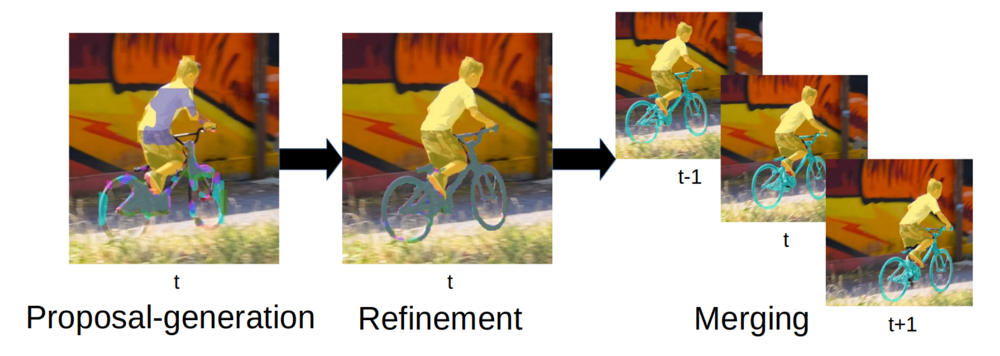

# PReMVOS: Proposal-generation, Refinement and Merging for Video Object Segmentation

[PReMVOS: Proposal-generation, Refinement and Merging for Video Object Segmentation](https://arxiv.org/abs/1807.09190), Jonathon Luiten, Paul Voigtlaender, Bastian Leibe, ACCV2018, CVPRW2018, ECCVW2018



PReMVOS is a video object segmentation method that won both the CVPR DAVIS challenge on video object segmentation, and the ECCV 1st Large-scale video object segmentation challenge on the YouTube-VOS dataset.

The arxiv version of PReMVOS paper (accepted at ACCV 2018) can be found here:
[arxiv paper](https://arxiv.org/abs/1807.09190)

The CVPR workshop version of the paper for the DAVIS challenge can be found here:
[DAVIS paper](https://www.vision.rwth-aachen.de/media/papers/premvos-2018/DAVIS-Semisupervised-Challenge-1st-Team.pdf)

The ECCV workshop short abstract version of the paper can be found here:
[YouTube-VOS paper](https://www.vision.rwth-aachen.de/media/papers/premvos-20182/Luiten_eccvw18_premvos_extended_abstract.pdf)

## Setup on which the code was tested
- python 3.6
- tensorflow 1.8
- pytorch 0.2.0_3 (pip install https://download.pytorch.org/whl/cu80/torch-0.2.0.post3-cp36-cp36m-manylinux1_x86_64.whl) (this is a version for CUDA 8.0, but I always run this using CUDA 9.0 and it works)
- CUDA 9.0
- cudnn 7
- COCO API for Python 3


## Usage
- To run a simple version of PReMVOS with pre-trained weights already finetuned on the first frame annotations of YouTube-VOS and DAVIS (this version was used to win the ECCV YouTube-VOS challenge), see `simple_run.sh` 
- To test if you have gotten it working, the result numbers should be:
Mean J: 0.7363.
Mean F: 0.80044.
Mean J&F: 76.8366.
This is mostly the same as the "Fast-finetuned" version presented in table 5 of the ACCV/arXiv version of the paper. In the paper this has J&F of 73.7, a fixed bug (Issue #2) results in this number now being 3.1% better.
- To run the full version, presented in the ACCV/arxiv paper, and that won the CVPR DAVIS challenge, the process is a little more complicated. First you need to generate 'lucid data dreaming' first frame image augmentations for each video, then you need to train seperate weights for the proposal networks and refinement network for each video individually. Having done this, you can then run the rest of the PReMVOS method with these fine-tuned weights. There are however, a number of other differences betweeen this version and the 'simple_run.sh' version including different parameters, a slightly different merging algorithm, different ways to get proposals and a different optical flow method. For more details see the ECCV Workshop short abstract paper. All the code and config files to do this are present in the dataset, but it is by no means trivial to get running. Also note that this process takes an extremely long time to run, especially the first frame image augmentations, and the per video fine-tuning.
- To run either the simple or the full method on a new video (not from DAVIS or YouTube-VOS), the method should be fine-tuned on the first frame annotations from that video, not doing so will result in a large drop in performance.

## Contact

If you encounter any problems with the code, please contact [Jonathon Luiten](https://www.vision.rwth-aachen.de/person/216/) (luiten at vision dot rwth-aachen dot de).

## Citation
If you use this code, please consider citing the following papers:

```
@inproceedings{luiten2018premvos,
  title={PReMVOS: Proposal-generation, Refinement and Merging for Video Object Segmentation},
  author={Jonathon Luiten and Paul Voigtlaender and Bastian Leibe},
  booktitle={Asian Conference on Computer Vision},
  year={2018}
}

@article{Luiten18CVPRW,
    author = {Jonathon Luiten and Paul Voigtlaender and Bastian Leibe},
    title = {{PReMVOS: Proposal-generation, Refinement and Merging for the DAVIS Challenge on Video Object  Segmentation 2018}},
    journal = {The 2018 DAVIS Challenge on Video Object Segmentation - CVPR Workshops},
    year = {2018}
}
@article{Luiten18ECCVW,
    author = {Jonathon Luiten and Paul Voigtlaender and Bastian Leibe},
    title = {{PReMVOS: Proposal-generation, Refinement and Merging for the YouTube-VOS Challenge on Video Object Segmentation 2018}},
    journal = {The 1st Large-scale Video Object Segmentation Challenge - ECCV Workshops},
    year = {2018}
}
```


